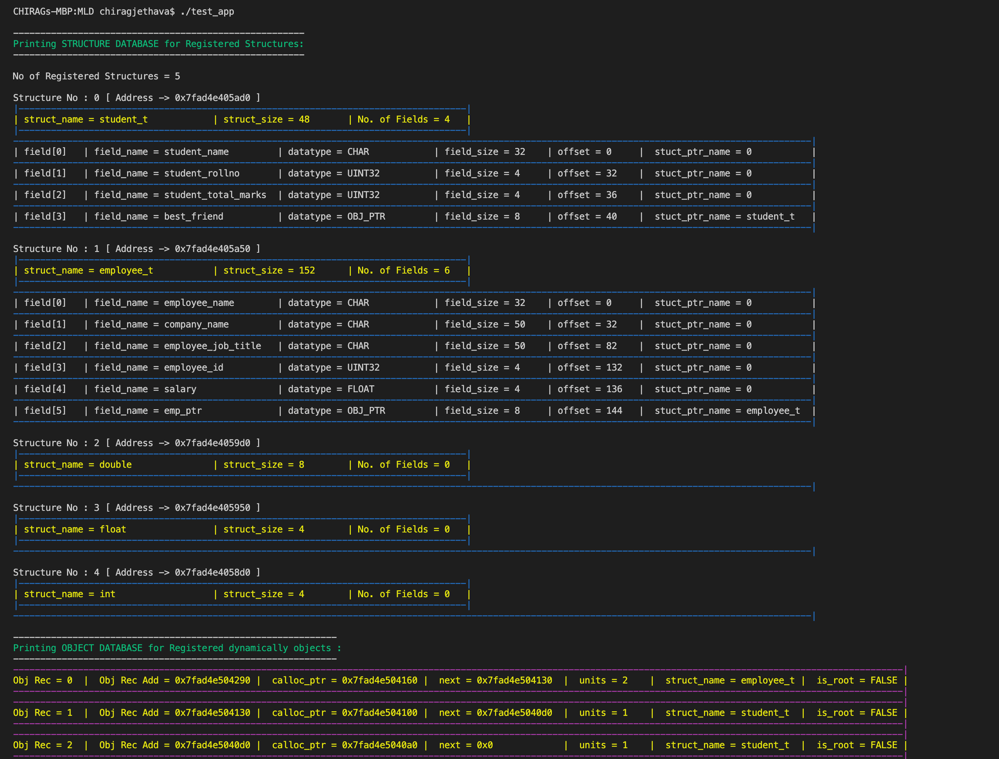
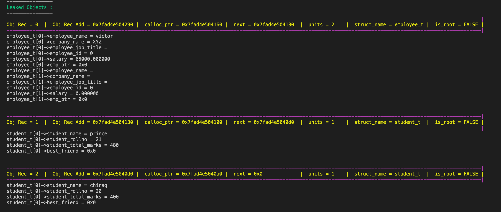
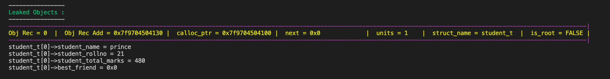
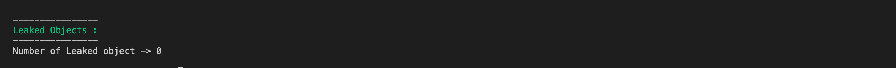

# Memory Leak Detector
The main goal of this project is implement functionality in C in order to detect and analyze memory leak in C application.

The idea is to create two database. Here database means linked list.

1. Structure Database -> Store all structure used in C application
2. Object Database    -> Store all dynamically allocated object 


## Sections
- [Memory Leak Detector](#memory-leak-detector)
  - [Sections](#sections)
  - [Building Memory Leak Detector dynamic library](#building-memory-leak-detector-dynamic-library)
  - [Building and testing application program](#building-and-testing-application-program)
  - [Test Result](#test-result)
    - [Case1:  None of the allocated objects are freed](#case1-none-of-the-allocated-objects-are-freed)
    - [Case2: Only one allocated object freed](#case2-only-one-allocated-object-freed)
    - [Case3: All allocated object freed](#case3-all-allocated-object-freed)

---
## Building Memory Leak Detector dynamic library
```
cd Src
make
```
Above step will build libmld.so (Memory Leak Detector) dynamic library inside Src dir which you can integrate with your C/C++ application program by including mld.h file.


## Building and testing application program
Before going to this stage user have to first build Memory Leak Detector library(libmld.so) mentioned in above step.
```
cd ..
make
```
This will build test_app executable test program in MemoryLeakDetector dir. This program is builded using libmld.so dynamic librray.
After succesfull compilation just run test_app executable program which will dislays all information about memory leak as shown in below images.
```
./test_app
```
## Test Result



### Case1:  None of the allocated objects are freed


### Case2: Only one allocated object freed 


### Case3: All allocated object freed



